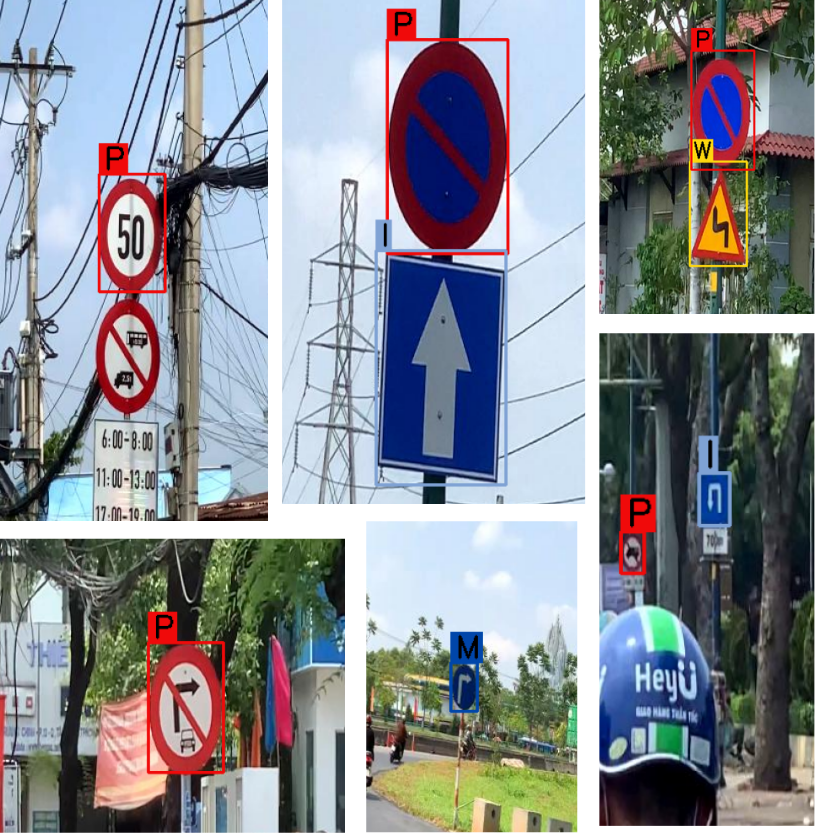
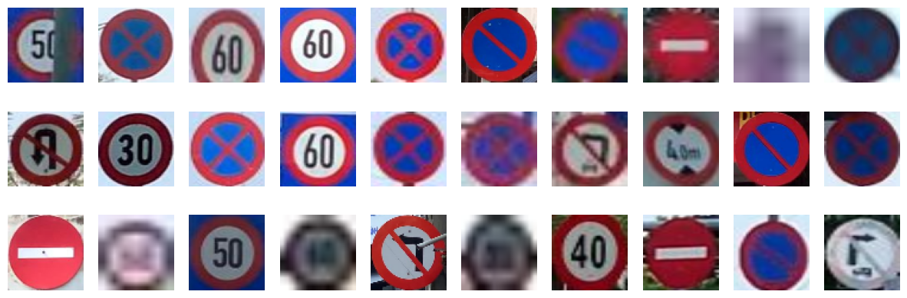
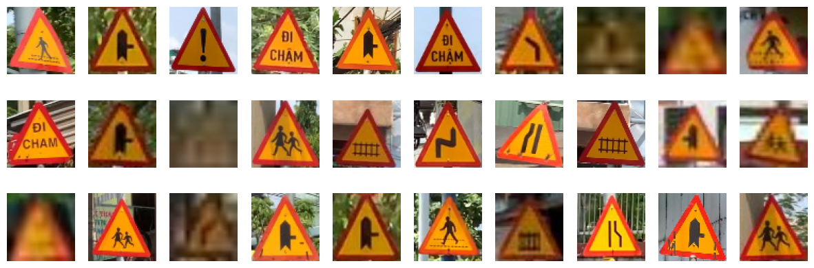
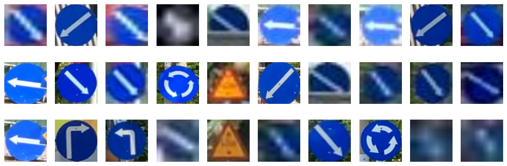
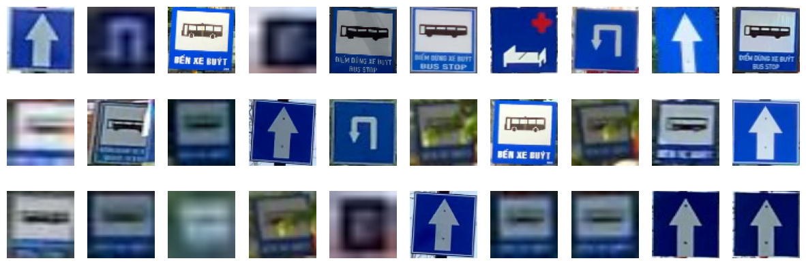

# Đồ án cuối kì CS231 -- Phân loại biển báo giao thông

Repository này chứa source code và các tài nguyên cho bài toán phân loại biển báo giao thông sử dụng các kỹ thuật học máy. Mục tiêu chính là phát triển một mô hình có khả năng phân loại biển báo giao thông vào một trong bốn loại: Biển báo cấm, Biển báo nguy hiểm, Biển báo hiệu lệnh, và Biển báo chỉ dẫn. Dự án bao gồm các bước tiền xử lý dữ liệu, trích xuất đặc trưng sử
dụng HOG, và huấn luyện các mô hình phân loại như k-Nearest Neighbors (kNN) và Random Forest.



## Các nhóm biển báo

### Biển báo cấm



### Biển báo nguy hiểm



### Biển báo chỉ dẫn



### Biển báo thông tin



## Demo

Thực hiện gọi app demo bằng lệnh

```bash
python3 scripts/predict.py
```

- Load ảnh biển báo giao thông vào cửa sổ pop-up hiện lên bằng cách nhấp vào `Load Image`
- Dùng mô hình để dự đoán và xem kết quả bằng cách nhấp vào `Predict and Display`


## Các tính năng

- **Tiền xử lý dữ liệu**: Tải, cắt, và trực quan hóa dữ liệu.
- **Trích xuất đặc trưng**: Sử dụng Histogram of Oriented Gradients (HOG) để nắm bắt các đặc trưng quan trọng.
- **Huấn luyện mô hình**: Triển khai các mô hình kNN và Random Forest.

## Yêu cầu hệ thống

- Python 3.11
- OS: Ubuntu 24.04 LTS (khuyến khích sử dụng Linux hoặc WSL thay thế cho Windows)
- Các thư viện: numpy, pandas, scikit-learn, matplotlib, opencv-python, scikit-image
- Xem thêm ở file `requirements.txt`

## Hướng dẫn sử dụng

1. Tạo môi trường ảo chứa các package cần thiết cho chương trình

```bash
python3 -m venv .env
echo "export PYTHONPATH=$(pwd)" >> .env/bin/activate
```

Sau đó kích hoạt môi trường ảo bằng cách thực thi lệnh `source .env/bin/activate` đối với Linux/MacOS.

2. Install các package cần thiết

```bash
pip install -r requirements.txt
```

3. Tải bộ dữ liệu
   Ta tải bộ dữ liệu từ Google Drive thông qua lệnh sau:

```bash
python3 scripts/download_data.py
```

4. Huấn luyện mô hình

Fine tune và huấn luyện mô hình kNN và Random Forest bằng lệnh

```bash
python3 scripts/train_model.py
```

- Kết quả của quá trình fine tune sẽ được lưu vào `results/hyperparameters_tunning`
- Kết quả của quá trình huấn luyện mô hình sẽ được lưu vào `models`

5. Đánh giá mô hình
   Tiến hành đánh giá hai mô hình trên tập test bằng lệnh

```bash
python3 scripts/evaluate_model.py
```

Kết quả của quá trình đánh giá mỗi mô hình sẽ cho ta biết `accuracy`, `precision`, `recall`, `f1-score` cũng như `confusion matrix` của mô hình đó trên tập test.

- Các metrics đánh giá mô hình sẽ được lưu lại trong thư mục `results/metrics`
- Các `confusion matrix` sẽ được lưu lại trong thư mục `results/visualizations`

## Cấu trúc thư mục

Dưới đây là giải thích chi tiết về cấu trúc thư mục của dự án phân loại biển báo giao thông:

### traffic_sign_classification/

Thư mục gốc của dự án chứa tất cả các tệp và thư mục cần thiết cho dự án.

#### ├── config/

- **config.yaml**: Tệp cấu hình chính của dự án, chứa các thông số cấu hình như đường dẫn dữ liệu, tham số mô hình, thiết lập huấn luyện và các cài đặt đầu ra.

#### ├── src/

Thư mục này chứa mã nguồn chính của dự án.

- **\_\_init\_\_.py**: Tệp này đánh dấu thư mục `src` như một gói Python.
- **config.py**: Đọc và thiết lập cấu hình từ tệp `config.yaml`.
- **data_processing.py**: Chứa các hàm xử lý dữ liệu, bao gồm tải và xử lý hình ảnh, trích xuất đặc trưng HOG.
- **model.py**: Chứa các hàm để tạo, huấn luyện, fine-tuning, và lưu các mô hình kNN và Random Forest.
- **utils.py**: Chứa các hàm tiện ích hỗ trợ cho các phần khác của dự án.

#### ├── models/

Thư mục này chứa các mô hình sau khi thực hiện huấn luyện.

- **knn_model.pkl**: Mô hình kNN đã được huấn luyện.
- **random_forest_model.pkl**: Mô hình Random Forest đã được huấn luyện.

#### ├── results/

Thư mục này lưu trữ các kết quả liên quan đến quá trình huấn luyện và đánh giá mô hình.

- **hyperparameter_tuning/**: Chứa kết quả của quá trình tìm kiếm siêu tham số cho các mô hình.
  - **knn_grid_search_results.csv**: Kết quả tìm kiếm siêu tham số cho mô hình kNN.
  - **random_forest_grid_search_results.csv**: Kết quả tìm kiếm siêu tham số cho mô hình Random Forest.
- **metrics/**: Lưu trữ các tệp kết quả đánh giá hiệu suất mô hình.
- **visualizations/**: Chứa các hình ảnh và biểu đồ trực quan hóa dữ liệu và kết quả.

#### ├── tests/

Thư mục này chứa các bài kiểm thử cho dự án (tự tạo các file kiểm thử và test ở đây).

- **test_mode.py**: Tệp kiểm thử cho các chức năng của dự án.

#### ├── scripts/

Thư mục này chứa các script để chạy và quản lý các tác vụ của dự án.

- **train_model.py**: Script chính để khởi động quá trình huấn luyện mô hình, bao gồm cả fine-tuning và huấn luyện các mô hình kNN và Random Forest.

#### ├── setup.py

Tệp cấu hình để cài đặt dự án như một gói Python, cho phép sử dụng các module từ thư mục `src`.

#### └── README.md

Tệp tài liệu của dự án, cung cấp thông tin tổng quan về dự án, hướng dẫn cài đặt, sử dụng, và các chi tiết liên quan khác.

